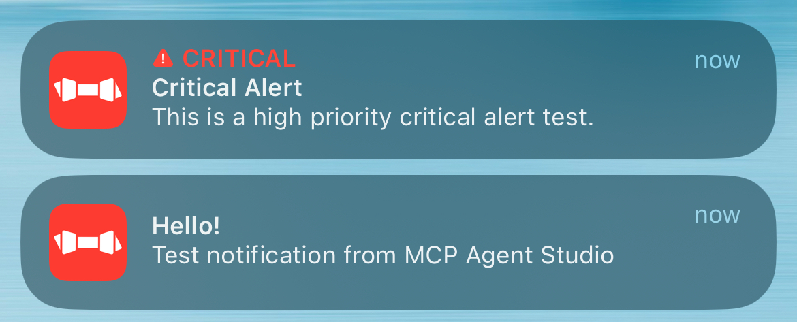

# MCP

> [!NOTE]
> MCP支持目前是实验性功能, 因此可能存在使用风险. 此外MCP目前只支持D1版本.

## MCP test

在部署成功后, 可使用免费MCP测试工具 [MCP Agent Studio](https://mcpplaygroundonline.com/mcp-agent-studio) 测试MCP服务:

    

随后应该能够收到类似的信息:

    

如果连接MCP服务器失败，请在 `Domains` &rarr; `Your Domain` &rarr; `Security` &rarr; `Settings` 检查Cloudflare的安全设置:

    

